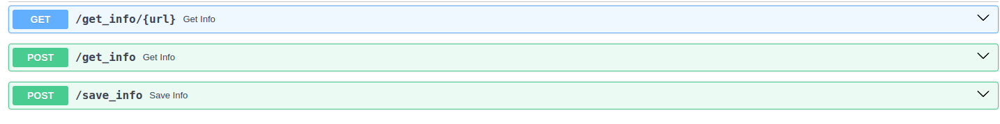

# API de scraping do Similarweb

API criada para o teste de desenvolvedor backend na Speedio

## Tecnologias Utilizadas 
  - Python
  - MongoDb
  - Docker para a imagem do MongoDb

## Funcionalidades
  - Armazenar informações de um site via URL
  - Verificar as informações de um site via URL

